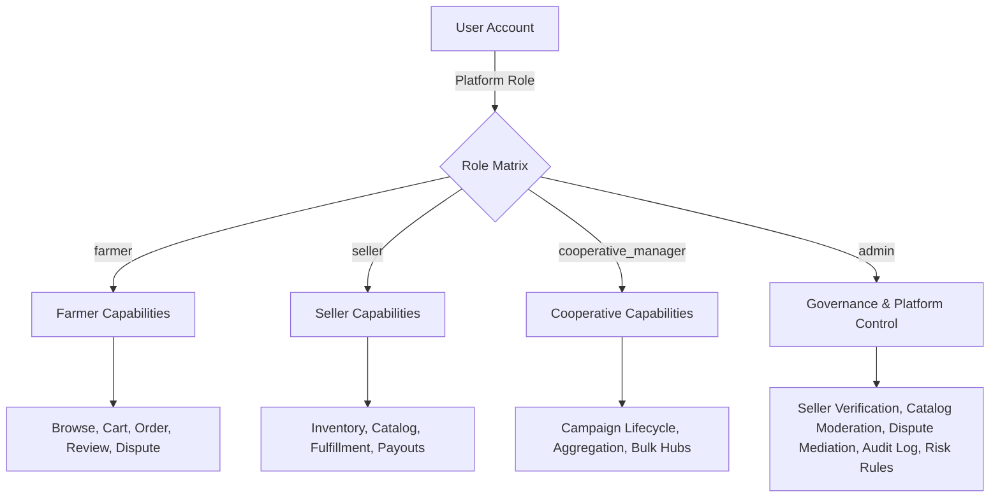
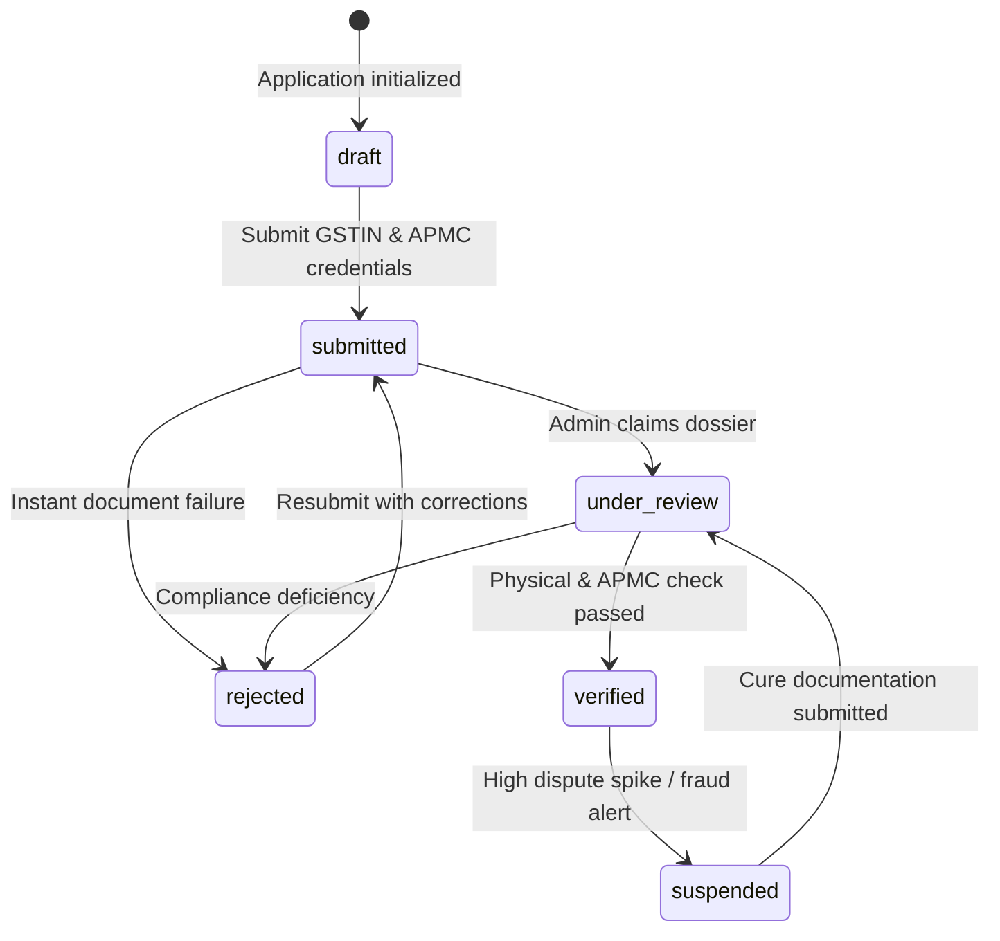
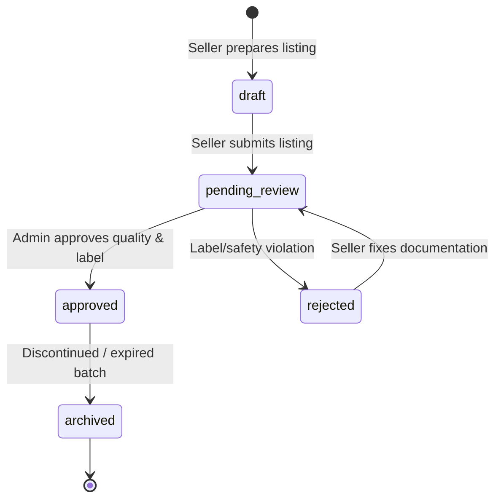
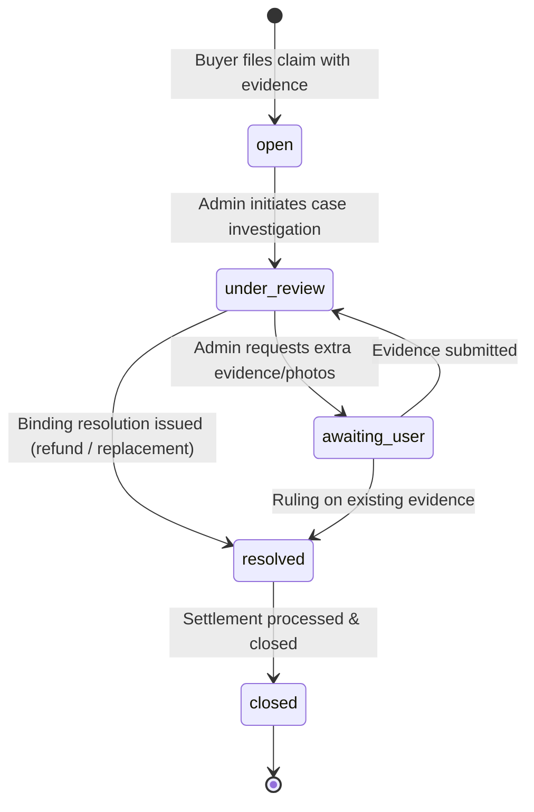

# AgriTrade Role & Permission Model

> **Stage 11 Specification** — Trust, Governance, Platform Control & Security Matrix

## 1. Overview & Architectural Principles

AgriTrade operates a multi-sided agricultural marketplace ecosystem with 4 distinct personas:

1. **Farmer (Buyer / Participant)**: Purchases farm inputs, tracks deliveries, joins cooperative bulk buying campaigns, rates products/sellers, and opens disputes under the SafeHarvest Buyer Protection policy.
2. **Seller (Input Manufacturer / APMC Distributor)**: Manages product catalog, syncs warehouse inventory, fulfills orders within dispatch SLAs, requests settlement payouts, and reviews sales intelligence.
3. **Cooperative Manager (FPO / Society Signatory)**: Organizes collective procurement campaigns, aggregates village purchasing volume, coordinates local fulfillment hubs, and unlocks volume discounts for smallholder farmers.
4. **Platform Administrator (Operations, Trust & Safety)**: Governs platform compliance, verifies seller business credentials and state agricultural licensing, moderates product catalog entries, mediates buyer/seller disputes, tracks append-only audit logs, and monitors real-time marketplace risk signals.



---

## 2. Granular Platform Permission Matrix

The platform evaluates permissions via centralized evaluator functions (`hasPermission`, `hasAnyPermission`, `hasAllPermissions`) across both Web (`apps/web/features/admin/domain/permissions.ts`) and Mobile (`apps/mobile/lib/features/admin/domain/permissions.dart`).

| Permission Key | Description | Farmer | Seller | Coop Mgr | Admin |
|---|---|:---:|:---:|:---:|:---:|
| `browse_products` | Search and inspect catalog listings | ✅ | ✅ | ✅ | ✅ |
| `place_orders` | Checkout, pay via gateway/COD | ✅ | ❌ | ❌ | ✅ |
| `create_reviews` | Submit product ratings and comments | ✅ | ❌ | ❌ | ✅ |
| `join_campaigns` | Commit volume to collective procurement | ✅ | ❌ | ✅ | ❌ |
| `create_disputes` | File transit damage or quality claim | ✅ | ❌ | ❌ | ❌ |
| `view_own_orders` | Inspect self order history and status | ✅ | ✅ | ✅ | ✅ |
| `manage_products` | Create & edit catalog offerings | ❌ | ✅ | ❌ | ❌ |
| `manage_inventory` | Adjust stock, reorder levels, MOQs | ❌ | ✅ | ❌ | ❌ |
| `manage_seller_orders` | Pack, dispatch, and fulfill orders | ❌ | ✅ | ❌ | ❌ |
| `request_payouts` | Request ledger payout transfers | ❌ | ✅ | ❌ | ❌ |
| `view_seller_analytics` | Inspect store sales, GMV, and SLAs | ❌ | ✅ | ❌ | ❌ |
| `manage_campaigns` | Launch & configure bulk campaigns | ❌ | ❌ | ✅ | ❌ |
| `monitor_participation` | Audit FPO farmer contribution volume | ❌ | ❌ | ✅ | ❌ |
| `manage_campaign_lifecycle` | Finalize or close procurement pools | ❌ | ❌ | ✅ | ❌ |
| `verify_sellers` | Approve, reject, or suspend seller licenses | ❌ | ❌ | ❌ | ✅ |
| `moderate_products` | Approve, reject, or archive catalog items | ❌ | ❌ | ❌ | ✅ |
| `manage_disputes` | Mediate cases, enforce refunds & rulings | ❌ | ❌ | ❌ | ✅ |
| `view_platform_analytics` | Monitor ecosystem GMV, SLAs, risk ratios | ❌ | ❌ | ❌ | ✅ |
| `manage_governance` | Enforce platform rules and policies | ❌ | ❌ | ❌ | ✅ |
| `view_audit_log` | Read immutable cryptographic event log | ❌ | ❌ | ❌ | ✅ |
| `manage_risk_signals` | Surface and clear automated fraud flags | ❌ | ❌ | ❌ | ✅ |
| `view_admin_dashboard` | Access SaaS operations console | ❌ | ❌ | ❌ | ✅ |

---

## 3. Governance Lifecycle State Machines

### 3.1 Seller Verification Lifecycle

All sellers onboarding onto AgriTrade must complete formal document verification before receiving the "Verified Seller" badge and dispatching goods.



#### Transition Rules:
- `draft` can only transition to `submitted`.
- `submitted` can transition to `under_review` or `rejected`.
- `under_review` can transition to `verified` or `rejected`.
- `verified` can transition to `suspended`.
- `suspended` can transition to `under_review`.
- Direct transition from `draft` to `verified` is **prohibited**.

---

### 3.2 Product Catalog Moderation Lifecycle

To safeguard agricultural safety and crop yields, all input products (certified hybrid seeds, water-soluble fertilizers, bio-stimulants, and crop protection chemicals) must be vetted against regulatory databases (CIB&RC, Seed Certification Agency).



#### Transition Rules:
- `rejected` listings require a mandatory written justification recorded in the audit trail.
- Terminal `archived` items cannot be reopened directly; sellers must submit a new batch.

---

### 3.3 Dispute Resolution & Mediation Lifecycle

Buyers are protected under the **SafeHarvest Buyer Protection** policy. When transit damage, delivery delay past sowing windows, or formulation mismatches occur, an order-linked dispute is opened.



---

## 4. Append-Only Audit Logging Architecture

Every governance intervention generates an immutable `audit_logs` record:

```typescript
interface AuditLogEntry {
  id: string;             // aud_<timestamp>
  actorId: string;        // ID of user or automated engine
  actorName: string;      // Human-readable actor
  actorRole: string;      // 'admin' | 'system'
  action: AuditAction;    // 'seller_verified' | 'product_approved' | etc.
  entityType: string;     // 'seller' | 'product' | 'dispute' | 'risk_signal'
  entityId: string;       // Unique ID of target
  entityLabel: string;    // Human-readable target label
  metadata: Record<string, string>; // Payload capturing previous and new state
  createdAt: string;      // ISO 8601 timestamp
}
```

Audit tables are protected by PostgreSQL RLS with `INSERT` and `SELECT` allowed, while `UPDATE` and `DELETE` are disallowed to guarantee tamper resistance.

---

## 5. Marketplace Risk Engine

Automated rule engine detects and surfaces anomalies:

| Rule Key | Severity | Trigger Threshold | Recommended Action |
|---|---|---|---|
| `DISPUTE_SPIKE_DETECTED` | Critical | Dispute rate > 5.0% over 14 days | Suspend seller dispatches; audit inventory |
| `PROHIBITED_SUBSTANCE_FLAG` | High | Chemical keyword match without CIB cert | Immediate listing suspension |
| `HIGH_VALUE_FIRST_TIME_BUYER` | Medium | First order > ₹50,000 on COD | Outbound verification call before dispatch |
| `GSTIN_MISMATCH` | Medium | Registered state differs from warehouse address | Request APMC branch registration proof |
