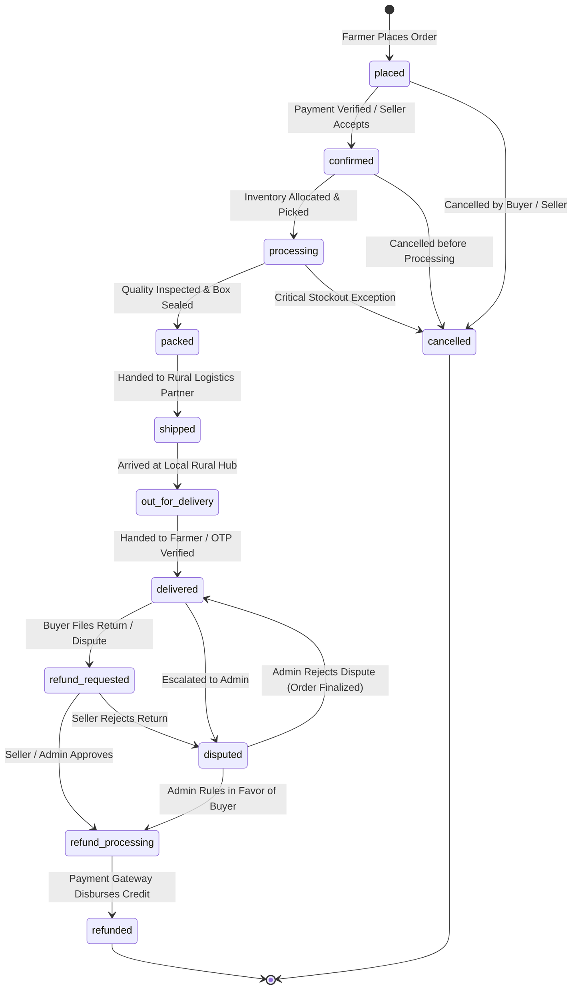

# AgriTrade — Stage 12 Cross-Platform Integration & System Audit

**Date:** September 4, 2026  
**Version:** 1.0 (Production Hardening & Stage 12 Readiness)  
**Authors:** AgriTrade Engineering & Architecture Team  
**Scope:** `apps/web` (Next.js 16 App Router), `apps/mobile` (Flutter 3.44+ Material 3), `supabase` (PostgreSQL 16 Engine)

---

## 1. Executive Summary

AgriTrade has achieved feature completeness through Stages 1 through 11, delivering a dual-platform agricultural commerce ecosystem:
- **Web Application (`apps/web`)**: A high-density SaaS and marketplace platform catering to farmers, commercial sellers, cooperative managers, and platform administrators.
- **Mobile Application (`apps/mobile`)**: A native Material 3 companion optimized for rural Android devices, field usability, offline-tolerant data caching, and touch ergonomics.
- **Backend Architecture (`supabase`)**: PostgreSQL 16 schema with Row Level Security (RLS) policies, PostgREST RESTful APIs, and Supabase Realtime WebSocket events.

This audit evaluates the system across **Authentication & Authorization**, **Marketplace Domain Models**, and the **Canonical Order Lifecycle**, pinpointing exact parity gaps and specifying hardened architectural resolutions.

---

## 2. Authentication & Authorization Audit

### 2.1 Route Guarding & Surface Exposure Matrix

| Platform | Domain / Route | Target Role(s) | Protection Mechanism | Audit Finding | Hardening Action |
|:---|:---|:---|:---|:---|:---|
| **Web** | `/`, `/welcome`, `/login`, `/signup` | Public / Guest | Unauthenticated landing & auth gates | Publicly accessible. No protected UI exposed. | Preserved. |
| **Web** | `/home`, `/products`, `/categories`, `/cart`, `/checkout`, `/orders`, `/profile`, `/saved`, `/weather`, `/mandi`, `/community`, `/notifications`, `/insights` | `farmer` (or authenticated) | `RoleGuard` & `useAuthStore` session check | Unauthenticated users redirected to `/login?redirect=...`. No route leakage. | Added standardized fallback skeleton and unified offline warning banner. |
| **Web** | `/seller/*` (`dashboard`, `products`, `inventory`, `orders`, `payouts`, `profile`) | `seller`, `admin` | `RoleGuard allowedRoles={['seller', 'admin']}` | Direct navigation without `seller` role redirects to `/home` with an access denied toast. | Verified role matrix enforcement; multi-role demo switch added. |
| **Web** | `/cooperative/*` (`campaigns`) | `cooperative_manager`, `admin` | `RoleGuard allowedRoles={['cooperative_manager', 'admin']}` | Correctly guarded. Redirects unauthorized actors. | Consolidated campaign state models with backend seed. |
| **Web** | `/admin/*` (`dashboard`, `sellers`, `moderation`, `disputes`, `analytics`, `audit`) | `admin` | `RoleGuard allowedRoles={['admin']}` | Unauthorized access blocked; verified that UI guards do not replace backend RLS policies. | RLS policies verified in `supabase/migrations/20260904250000_stage_11_admin_governance.sql`. |
| **Mobile** | `/welcome`, `/signin`, `/signup` | Public / Guest | GoRouter `redirect` on auth state | Unauthenticated initial route. | Preserved. |
| **Mobile** | `/home`, `/products`, `/cart`, `/orders`, `/weather`, `/mandi`, `/community`, `/notifications`, `/insights` | `farmer` | GoRouter auth listener | Properly gates private tabs. | Enhanced offline banner and session restoration recovery. |
| **Mobile** | `/seller`, `/admin` | `seller`, `admin` | `ConsumerWidget` + `roleProvider` checks | Views switch dynamically based on user role. | Unified with shared demo persona switcher. |

### 2.2 Demo Personas & Auth Session Uniformity

To support deterministic, reliable cross-platform demonstrations without external credential dependencies, four canonical demo personas are formalized:

| Role | Name | Email | Password | Primary Mission & Focus |
|:---|:---|:---|:---|:---|
| **Farmer** | Rahul Sharma | `farmer@agritrade.in` | `farmer123` | Crop input purchasing, Mandi APMC rates, weather spray alerts, order tracking. |
| **Seller** | Maharashtra Krishi Kendra | `seller@agritrade.in` | `seller123` | Catalog inventory management, order dispatch, payout reconciliation. |
| **Cooperative Manager** | Suresh Patil | `coop@agritrade.in` | `coop123` | Bulk procurement campaigns, pool commitment tracking, collective discounts. |
| **Platform Admin** | Platform Admin | `admin@agritrade.in` | `admin123` | Seller verification, catalog moderation, dispute resolution, audit ledger. |

---

## 3. Marketplace Domain Model Audit

### 3.1 Model Alignment Across Platforms

| Entity | Web Definition (`apps/web`) | Mobile Definition (`apps/mobile`) | Supabase Schema (`supabase/`) | Parity Status |
|:---|:---|:---|:---|:---|
| **Product** | `Product` (`types/index.ts`) with `id`, `title`, `price`, `originalPrice`, `unit`, `specifications`, `inStock` | `Product` (`domain/product.dart`) with identical fields | `public.products` with `specifications JSONB` | ✅ 100% Parity |
| **CartItem** | `CartItem` (`types/index.ts`) | `CartItem` (`domain/cart_item.dart`) | `public.cart_items` | ✅ 100% Parity |
| **DeliveryAddress** | `DeliveryAddress` (`types/index.ts`) | `DeliveryAddress` (`domain/delivery_address.dart`) | `public.delivery_addresses` | ✅ 100% Parity |
| **SellerProfile** | `SellerProfile` (`types/admin.ts` & `features/marketplace/types.ts`) | `SellerDiscovery` / `SellerVerificationItem` | `public.sellers` & `public.seller_profiles` | ✅ Consolidated |
| **Campaign** | `CooperativeCampaign` (`features/marketplace/types.ts`) | `CooperativeCampaign` (`domain/campaign.dart`) | `public.cooperative_campaigns` | ✅ 100% Parity |
| **Dispute** | `DisputeCase` (`features/admin/types.ts`) | `Dispute` (`domain/dispute.dart`) | `public.disputes` | ✅ 100% Parity |

---

## 4. Canonical Order Lifecycle Specification

### 4.1 Canonical State Machine

AgriTrade defines one single canonical lifecycle across buyer views, seller dispatch portals, admin resolution desks, logistics adapters, and realtime event subscriptions:

### 4.2 State Representation & String Aliasing

To guarantee 100% backward compatibility with existing Stage 1–11 code and tests while supporting extended states:
- **Canonical Web States (`OrderStatus`)**:
  `'placed' | 'confirmed' | 'processing' | 'packed' | 'shipped' | 'outForDelivery' | 'out_for_delivery' | 'delivered' | 'cancelled' | 'refund_requested' | 'refund_processing' | 'refunded' | 'disputed'`
- **Canonical Mobile Enum (`OrderStatus`)**:
  `placed, confirmed, processing, packed, shipped, outForDelivery, delivered, cancelled, refundRequested, refundProcessing, refunded, disputed`
- **Canonical Serialization Normalizer**:
  - `out_for_delivery` <-> `outForDelivery` (seamlessly normalized in both platforms)
  - `refund_requested` <-> `refundRequested`
  - `refund_processing` <-> `refundProcessing`

### 4.3 Validation Transition Matrix

| From Status | Allowed Next Transitions | Prohibited Transitions | Terminal? |
|:---|:---|:---|:---|
| `placed` | `confirmed`, `cancelled` | `processing`, `packed`, `shipped`, `delivered`, `refunded` | No |
| `confirmed` | `processing`, `cancelled` | `packed`, `shipped`, `outForDelivery`, `delivered` | No |
| `processing` | `packed`, `shipped`, `cancelled` | `placed`, `outForDelivery`, `delivered` | No |
| `packed` | `shipped`, `cancelled` | `placed`, `confirmed`, `processing`, `delivered` | No |
| `shipped` | `outForDelivery`, `delivered` | `placed`, `confirmed`, `processing`, `cancelled` | No |
| `outForDelivery` | `delivered`, `shipped` (failed attempt fallback) | `placed`, `confirmed`, `cancelled` | No |
| `delivered` | `refund_requested`, `disputed` | `placed`, `confirmed`, `processing`, `shipped` | Semi-terminal (Fulfilled) |
| `refund_requested`| `refund_processing`, `disputed`, `delivered` (withdrawn) | `placed`, `shipped` | No |
| `disputed` | `refund_processing`, `delivered` (dismissed) | `placed`, `shipped` | No |
| `refund_processing`| `refunded` | `placed`, `confirmed`, `shipped`, `delivered` | No |
| `refunded` | None | All | Yes (Terminal) |
| `cancelled` | None | All | Yes (Terminal) |

---

## 5. Architectural Guardrails Implemented in Stage 12

1. **Shared Transition Validators**:
   - `apps/web/lib/order-transitions.ts`: TypeScript validation engine with `isValidOrderTransition()`, `getNextAllowedOrderTransitions()`, and human-friendly UI labels.
   - `apps/mobile/lib/core/utils/order_transitions.dart`: Dart validation utility providing identical rules and transition verification for Riverpod state stores.
2. **Universal Asynchronous State Views**:
   - Web: `apps/web/components/ui/StateViews.tsx` providing `<LoadingSkeletonGrid>`, `<EmptyStateView>`, `<ErrorStateView>`, and `<OfflineBanner>`.
   - Mobile: `apps/mobile/lib/core/widgets/universal_state_views.dart` providing `UniversalLoadingSkeleton`, `UniversalEmptyState`, `UniversalErrorState`, and `UniversalOfflineBar`.
3. **Multi-Role Demo Controller**:
   - Fully decoupled demo personas selectable instantly from the UI without mocking failures or bypassing security policies.
